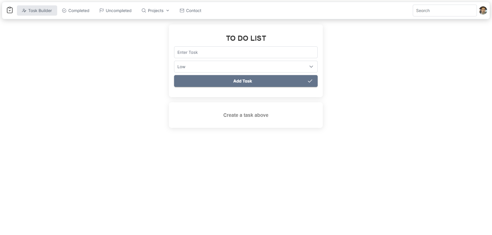

# To-Do List Application

## Overview
This is a simple and intuitive To-Do List application built with React. Users can add, edit, and delete tasks, as well as mark them as completed. The application features a priority system for tasks, allowing users to manage their workload effectively.

## Features
- **Task Management**: Add, edit, and delete tasks easily.
- **Priority Levels**: Assign priorities (Low, Medium, High) to tasks.
- **Completed Tasks**: View and manage tasks that have been completed.
- **User-Friendly Interface**: Clean design and easy navigation.

## Screenshots
### Main Page
 <!-- Placeholder for main page screenshot -->

### Completed Tasks
[alt text](image-1.png) <!-- Placeholder for completed tasks screenshot -->

## Installation
1. Clone the repository:
   ```bash
   git clone https://github.com/SayedRZA/ToDoApp.git
